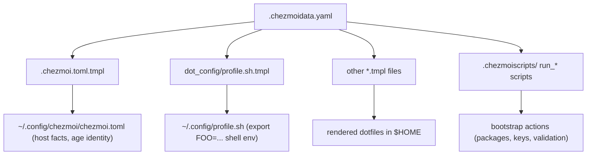
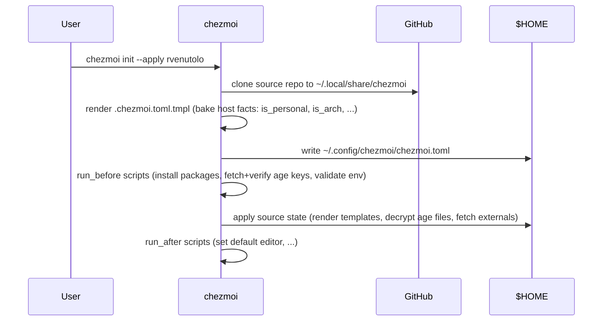
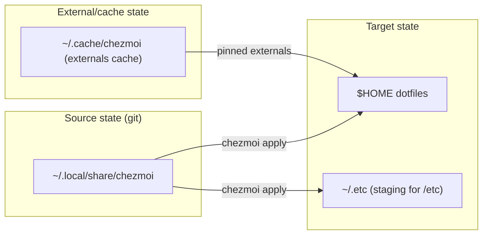

# Architecture

How this repo turns one YAML file of facts into rendered config across hosts.
This document is the picture; [CLAUDE.md](../CLAUDE.md) is the ground truth for
conventions.

## Data flow: one source, many consumers

`.chezmoidata.yaml` holds the shared facts (hostnames, paths, git repo list,
age public key, weather city). Chezmoi loads it automatically and every
template reads from it — there is no second copy of any fact.

Shell code never re-derives a shared fact: it sources the rendered
`~/.config/profile.sh`. Templates never use `{{ env "FOO" }}` for shared facts
(a pre-commit hook enforces this) because a fresh machine has no environment
yet — see [CLAUDE.md](../CLAUDE.md#standard-env-vars).

## Fresh-machine bootstrap

What happens on `chezmoi init --apply <repo>` on a blank host:

Host facts (`is_personal` / `is_work` / `is_server`, `is_arch` / `is_debian` /
`is_fedora`, ...) are **baked at init time** into the rendered
`chezmoi.toml`. Templates branch on them at apply time; a host must re-run
`chezmoi init` to pick up changes to fact derivation.

## State boundaries

- **Source state** is this repo. Filenames encode target metadata
  (`dot_`, `private_`, `exact_`, `encrypted_`, `symlink_`, `.tmpl`) — see
  [CLAUDE.md](../CLAUDE.md#chezmoi-source-state-conventions).
- **Target state** is what `chezmoi apply` materializes into `$HOME`. Files
  under `~/.etc/` are staging only: wiring into `/etc` is done manually by
  set-up scripts in the separate personal scripts repo, never by chezmoi.
- **External state**: third-party files/archives declared in
  `.chezmoiexternal.toml.tmpl`, pinned to commit SHAs and cached under
  `~/.cache/chezmoi/`. A SHA bump changes the URL, which busts the cache.
